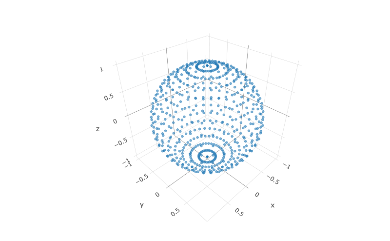

Scanning Algoritm Improvement Analysis
================

# Introduction

This report is a look into one of the issues that affects the OpenLidar
speed of operation. In high end scanners they spin very fast in order to
capture data quickly, but even with their speed scans of an entire cave
passage / large room can take 5 - 15 minutes depending on the accuracy
needed. In large passages with little variation a 5 minute scan is
sufficient, but in rooms that have lots of small details a 15 minute
scan may be needed. Or perhaps a 5 minute scan can be completed and then
a partial scan can be completed at higher resolution.

The OpenLidar project however is not able to spin the lidar module any
faster and still capture data. A professional lidar can capture 1M data
points per second. The LidarLite v3 that the OpenLidar is based on can
only capture 1K points per second. The cost savings is substantial, but
the methodology cannot exactly follow that of much more expensive
equipment.

# Overscanning

One option for improving the speed of scans on the cheaper OpenLidar is
to limit how much overscanning we perform. In a standard lidar there is
a pitch motor that spins the lidar module in a circle vertically, and a
yaw motor that slowly rotates the upper gimbal in a circle. In this type
of scanning configuration every rotation scans the top point of the area
surrounding the lidar. If you perform a scan every 1 degree of yaw then
you will scan the same top point 360 times. More to the point, the
points near the poles of the sphere surrounding the lidar will be much
more dense than the points near the equator.

## Plotting the overscanning

We can simulate this point cloud easily using a small program.

``` r
library(dplyr)
```

    ## 
    ## Attaching package: 'dplyr'

    ## The following objects are masked from 'package:stats':
    ## 
    ##     filter, lag

    ## The following objects are masked from 'package:base':
    ## 
    ##     intersect, setdiff, setequal, union

``` r
library(plotly)
```

    ## Loading required package: ggplot2

    ## 
    ## Attaching package: 'plotly'

    ## The following object is masked from 'package:ggplot2':
    ## 
    ##     last_plot

    ## The following object is masked from 'package:stats':
    ## 
    ##     filter

    ## The following object is masked from 'package:graphics':
    ## 
    ##     layout

``` r
deg2rad <- function(deg) {(deg * pi) / (180)}

# Using a for loop we could spin x around 360 times then increment y by 1 and repeat. 
# But this would be quite slow as there are 129,600 combinations to do this. In fact,
# this would be too many to plot. 
# df <- tibble(
#   theta = numeric(),
#   phi = numeric(),
#   r = numeric()
# )
# 
# index <- 1
# for(phi in 1:360){
#   for(theta in 1:360){
#     df <- df %>% bind_rows(tibble(theta = theta, phi = phi,r = 1))
#     # df[index,'theta'] <- theta
#     # df[index,'phi'] <- phi
#     # df[index,'r'] <- 1
#     index <- index + 1
#   }
# }

# We can do this by 10 degrees to make it faster and easier to plot. And R has a 
# built in function for finding every permutation that is quick. 
df <- expand.grid(theta = seq(from = 0, to = 350, by = 10),
                  phi = seq(from = 0, to = 350, by = 10))

df <- df %>% 
  # we are plotting a circle so make it a constant radius
  mutate(r = 1) %>% 
  # Later calcs are in radians instead of degrees...
  mutate(theta_rad = deg2rad(theta),
         phi_rad = deg2rad(phi)) %>%
  # Calculate position in x,y,z for easy plotly plotting.
  mutate(
    x = r*cos(phi_rad)*sin(theta_rad),
    y = r*sin(theta_rad)*sin(phi_rad),
    z = r*cos(theta_rad)
  )

plt <- plot_ly(df,x = ~x, y = ~y, z = ~z) %>%
  add_markers(opacity = 0.5,size = 10)

# plt
```



As you can see by zooming and scrolling, there are 36 points around each
“latititude” of the circle. The top second to top points on the circle
are all touching because they are so close.

This brings up the question about whether there is another algorithm
that can both space the points out more evenly (less points needed) and
do it faster within the limitations of the gimbal hardware.
